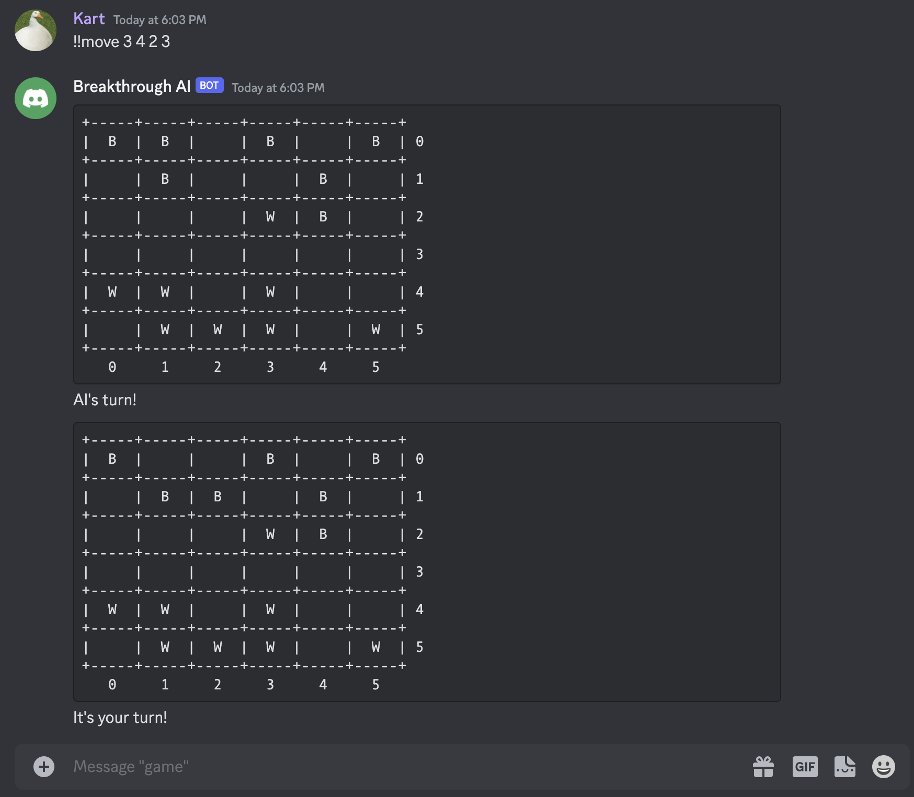

# Obtaining a Bot Token

- Navigate to [https://discord.com/developers/](https://discord.com/developers/)
- Tap on `New Application`, fill in a name, select the `Personal` team and tap on `Create`.
- On the left sidebar, tap on `Bot`.
- Tap `Add Bot` and follow through with your 2FA code (if required).
- Once the bot has been added, tap 'Copy` under token and save this in a non-public location.
  - This token should never be revealed publicly, as it allows anyone to gain access to your bot.

# Setup Instructions

- Copy over `template.py` into the `/ai` directory
- In `template.py`, replace `import utils` with `import ai.utils as utils`
- In `main.py`, replace `YOUR_TOKEN_HERE` with your bot's token from the previous section.
- Create an invite link through the following steps:
  - On the Discord Developer Portal, navigate to: `Applications` > `{Bot}` > `OAuth2` > `URL Generator`
  - Select the `bot` permission under `Scopes`
  - Under `Text Permissions`, select the following:
    - `Send Messages` (Optional)
    - `Send Messages in Threads` (Recommended)
    - `Read Message History`
  - Tap on `Copy` and invite your bot to your server.
- Run `main.py`, and enjoy playing!

# Usage Instructions

- The bot will automatically join any server it is invited to.
- `!!new` will start a new game.
- `!!move src_x src_y dest_x dest_y` will move a piece from `(src_x, src_y)` to `(dest_x, dest_y)`.
- The bot will announce when it is your turn.
- The bot will announce when the game is over.

# Sample Screenshot

# Known Issues

- The bot's messages are not formatted for smaller screens.
- Only one user can play against the bot at any given time.